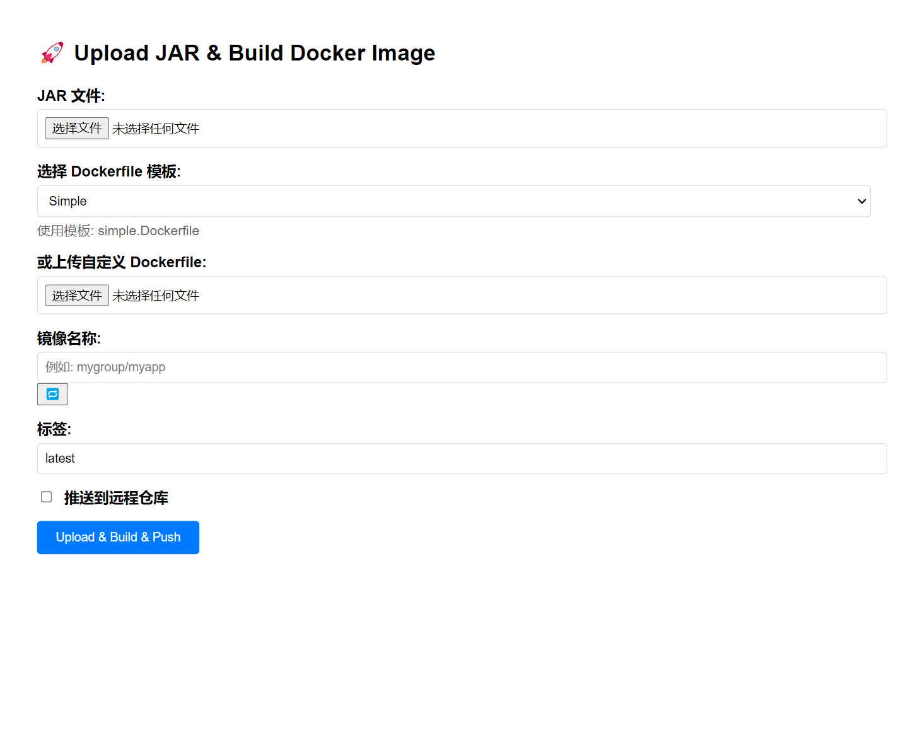

# jar2docker - JAR 包一键转 Docker 镜像工具

一个轻量级 Web 工具，将上传的 Java JAR 文件通过 Web 界面一键构建成 Docker 镜像。适合开发、测试环境快速打包部署，支持模板化构建与基本认证。

 <!-- 可选：添加截图 -->

## 🚀 功能特性

- ✅ **Web 图形化操作**：无需命令行，拖拽上传 JAR 文件
- ✅ **自动镜像命名**：根据 JAR 文件名智能生成推荐镜像名（如 `myapp/demo-service`）
- ✅ **刷新按钮**：一键重新生成推荐名称
- ✅ **模板化构建**：`templates/` 目录下 `.Dockerfile` 文件自动加载为模板
- ✅ **模板管理**：Web 端可视化增删改查 Dockerfile 模板
- ✅ **Compose 镜像导出**：上传 docker-compose.yml 批量下载所有镜像
- ✅ **HTTP Basic 认证**：全局保护，防止未授权访问
- ✅ **容器化部署**：自身可运行在 Docker 容器中，调用宿主机 Docker API
- ✅ **零依赖配置**：首次运行自动生成 `config.yml` 和默认模板
- ✅ **镜像导出**：一键拉取最新镜像并导出为 `.tar` 或 `.tar.gz`

## 📦 项目结构
```
jar2docker/
├── jar2docker.py            # 主程序（Python HTTP 服务）
├── templates/               # 内置模板目录（打包在Docker镜像中，只读）
│   ├── dragonwell8.Dockerfile
│   ├── dragonwell17.Dockerfile
│   └── ...
├── data/                    # 数据目录（所有会更新的数据，Docker卷映射）
│   ├── config.yml           # 配置文件（首次运行自动生成）
│   ├── templates/           # 用户自定义模板目录（可读写）
│   │   └── ...（用户上传或编辑的模板）
│   ├── uploads/             # 临时存储上传的 JAR 文件
│   ├── docker_build/        # 构建上下文目录
│   └── exports/             # 镜像导出目录
├── static/                  # 静态资源（Bootstrap、FontAwesome、jQuery等）
├── index.html               # 前端页面
├── requirements.txt         # Python 依赖
├── Dockerfile               # 容器化部署文件
└── README.md                # 本文件
```


## ⚙️ 快速开始（本地运行）

### 1. 准备环境

确保已安装：
- Python 3.8+（推荐使用 [python.org](https://www.python.org/) 官方安装包，避免 `distutils` 缺失）
- Docker（用于构建镜像）
- `pip`


### 2. 安装依赖

```bash
pip install -r requirements.txt

python jar2docker.py

```
### 2. 构建容器
```bash
docker build -t jar2docker .

```

### 3. 直接使用
```bash
docker run -d \
  -p 8000:8000 \
  -v /var/run/docker.sock:/var/run/docker.sock \
  -v $(pwd)/data:/app/data \
  --name jar2docker \
  registry.cn-shanghai.aliyuncs.com/51jbm/jar2docker

# 默认账号密码: admin/admin
# 
# 说明：
# - /var/run/docker.sock 映射用于调用宿主机Docker
# - $(pwd)/data 映射用于持久化配置、模板、上传文件、导出文件等数据
# - 首次运行会自动创建 data 目录及其子目录
```

## 🧩 模板管理

### 双模板目录设计

系统支持**内置模板**和**用户自定义模板**两种：

1. **内置模板** (`templates/`)
   - 打包在 Docker 镜像中，提供开箱即用的模板
   - 只读，不可删除或修改
   - 包含常用的 Dragonwell 8/17 等模板
   - Docker 容器重启后依然存在

2. **用户自定义模板** (`data/templates/`)
   - 通过 Docker 卷映射持久化
   - 可读写，支持新增、编辑、删除
   - 用户上传或编辑的模板保存在此
   - 与宿主机同步，数据持久化

### 模板优先级

- 读取时：优先使用用户自定义模板，如果不存在则使用内置模板
- 编辑内置模板：会在 `data/templates/` 中创建同名文件进行覆盖
- 删除内置模板：不允许删除，但可以创建同名用户模板覆盖

### 使用方法

- 在 Web 页面中，`模板管理` 卡片会列出所有模板（内置 + 用户自定义）
- 点击 **新增模板** 创建新的用户自定义模板
- **预览**：查看任何模板的内容
- **编辑**：
  - 编辑内置模板 → 在用户目录创建同名模板覆盖
  - 编辑用户模板 → 直接修改
- **删除**：只能删除用户自定义模板，内置模板不可删除
- 构建表单中的模板下拉框会同步模板列表，选择后即可直接复用

## 🧾 Compose 镜像导出

- 点击“上传 JAR 并构建”卡片右上方的 **Docker Compose 镜像导出** 区块，上传 `docker-compose.yml` 或任意 YAML 文本即可自动解析所有 `services.*.image`。
- 解析结果会列表展示并支持全选/单选，单个镜像可以立即下载，勾选多条后可一键批量下载（前端会依次触发下载，免去逐个操作）。
- 下载时可选择 `.tar` 或 `.tar.gz` 两种格式，适配不同的传输与存储需求。
